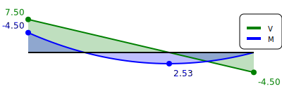

# FLIP
Parametric Structural Beam & Frame Analysis in Python
A lightweight, transparent, script‑driven environment for structural analysis.
Built for engineers who want full control, reproducibility, and the freedom to automate everything — without the constraints of GUI‑based FEM tools.

🚀 Why This Instead of a GUI?
Traditional FEM software is powerful, but it locks you into fixed workflows, hidden assumptions, and manual clicking.
This project takes the opposite approach:

* Full transparency — every node, element, load, and solver step is visible in code
* Parametric by design — geometry, loads, and materials are just variables
* Automation & optimization — loops, sweeps, and design exploration become trivial
* Reproducible & version‑controlled — models are plain text, perfect for Git
* Custom visualization — filled N/V/M diagrams, diagrams on structure, hinge markers, etc.
* Fully extensible — add new loads, materials, solvers, or post‑processing routines

This is structural analysis for students & engineers who want to think, not click.

## Installation
The project is pure Python and depends only on a small set of lightweight libraries.

### Clone the repository
```
bash
git clone https://github.com/yourname/yourrepo.git
cd yourrepo
```
### Create a virtual environment (recommended)
```
bash
python3 -m venv venv
source venv/bin/activate   # Linux/macOS
venv\Scripts\activate      # Windows
```
### Install dependencies
```
bash
pip install -r requirements.txt
```

## Getting Started
Here’s the smallest possible example to get you up and running.

### Create a simple beam model
```python
import sys
sys.path.append("..")
from flip import Solver, Domain, Beam2D, Node, Material, CrossSection, UniformDistributedLoad, DofID, plot_internal_forces_on_structure, plot_model_drawsvg

# Domain
solver = Solver()
domain = solver.domain
    
# Nodes
domain.add_node(Node(1, domain, coords=[0.0, 0.0, 0.0], bcs=[DofID.Dx, DofID.Dz, DofID.Ry]))
domain.add_node(Node(2, domain, coords=[3.0, 0.0, 0.0], bcs=[DofID.Dx, DofID.Dz]))
# Material & section
domain.add_material(Material("mat01", e=210e9))
domain.add_cs(CrossSection("cs01", a=0.02, iy=8e-6, k=1.0e32))

# Element
domain.add_element(Beam2D(1, domain, nodes=(1, 2), mat="mat01", cs="cs01"))

# Load
domain.apply_element_load(1, UniformDistributedLoad(fz=4.0) )

# Solve
solver.solve()

## Plot results
plot_model_drawsvg(domain, width_px=500, height_px=300, show_deformed=True, deform_scale=400000, margin=60)

plot_internal_forces_on_structure (domain, diagrams=["V", "M"], scale=0.1, height_px=300, margin=80)
```



## Who Is This For?
* Engineers who want more than a GUI
* Educators teaching FEM fundamentals & students, see sample [demo](examples/teaching_fem.ipynb)
* Designers building parametric workflows
* Anyone who wants structural analysis that’s hackable, transparent, and future‑proof

Happy coding!